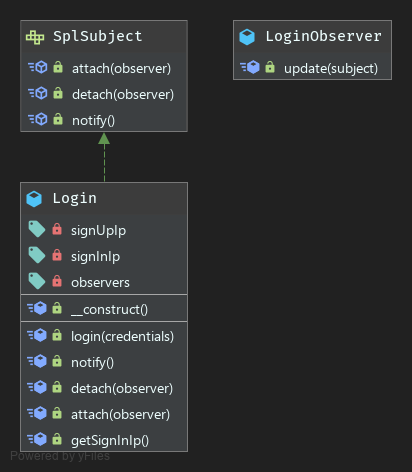

# Observer Pattern

**Definition**
```
The observer pattern is a software design pattern in which an object, called the subject, maintains a list of its 
dependents, called observers, and notifies them automatically of any state changes, usually by calling one of their methods.

The Observer pattern allows an object to publish changes to its state. 
Other objects subscribe to be immediately notified of any changes.
```

***Goals of observer pattern***
- Reducing communication coupling
- Enforcing single responsibility
- Leveraging extensibility
- Leveraging unit testability


### UML

